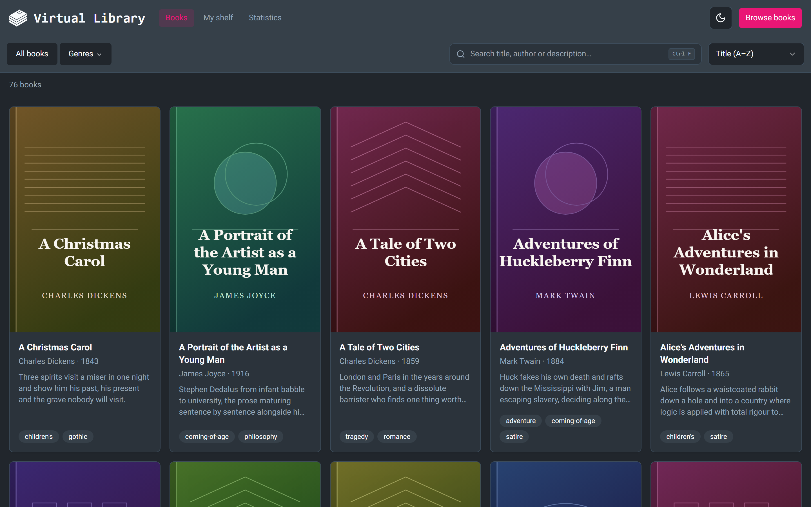
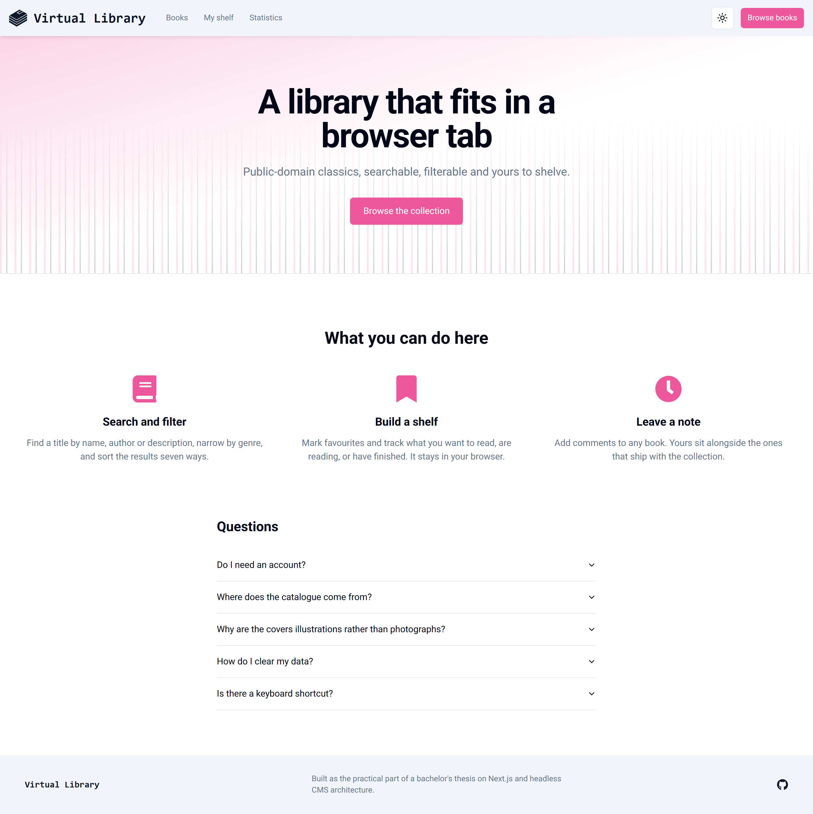
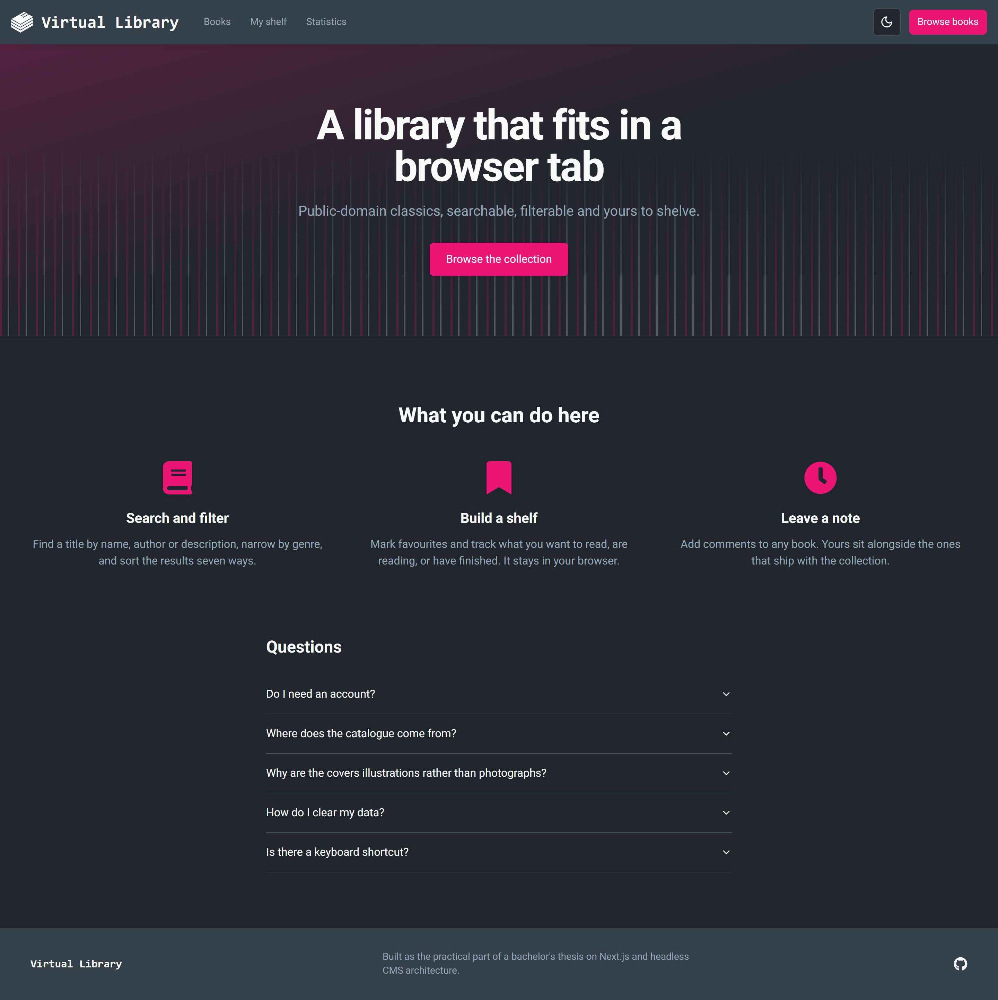
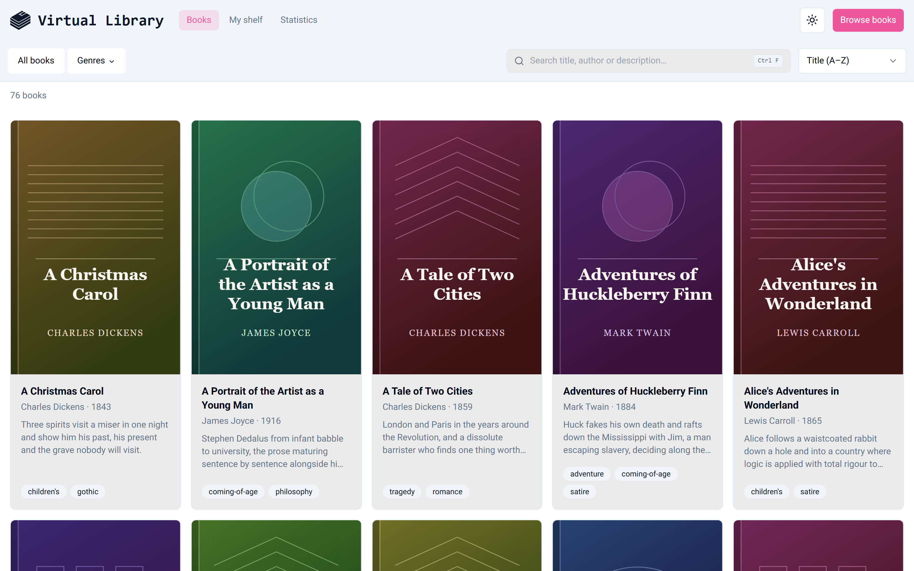
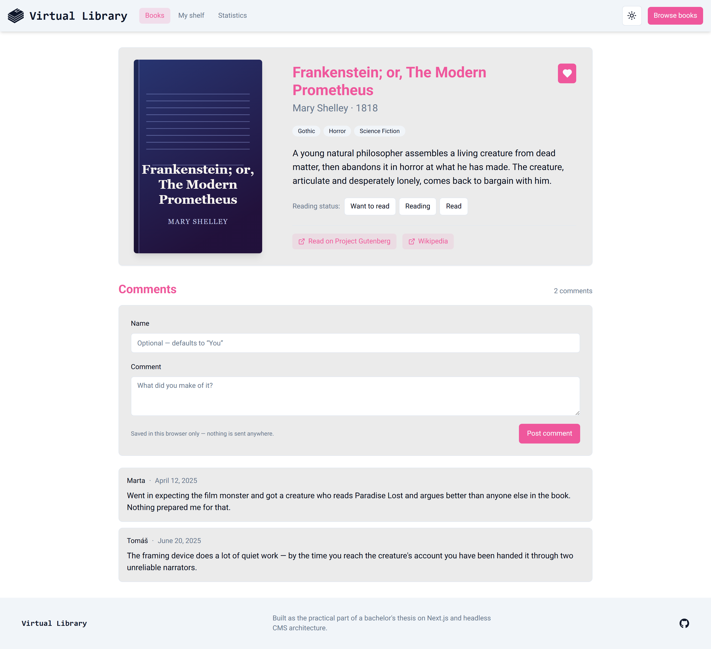
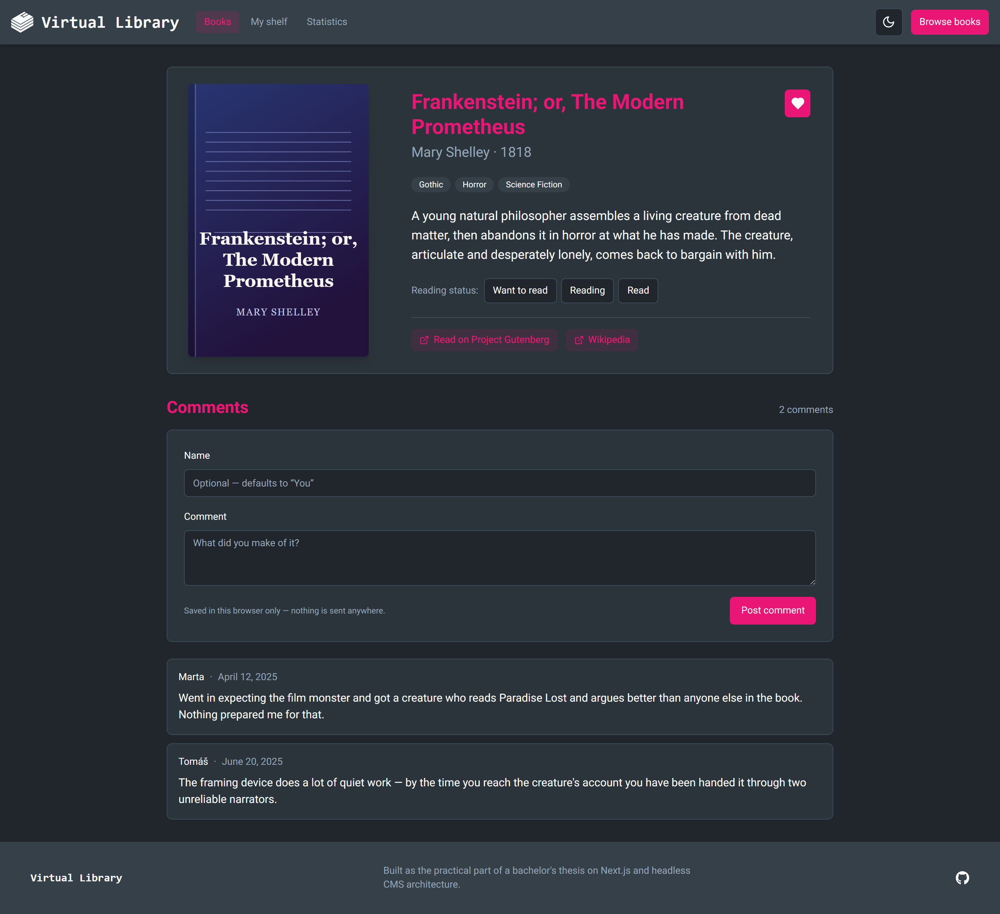
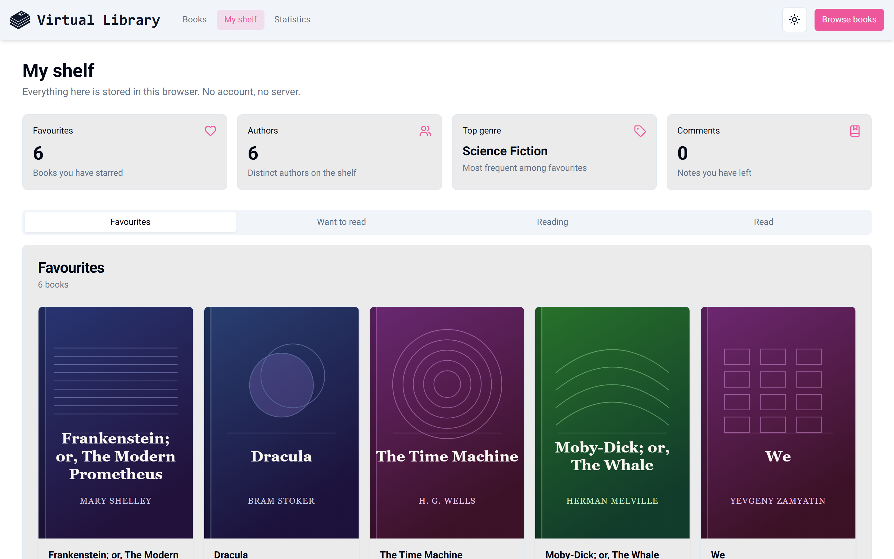
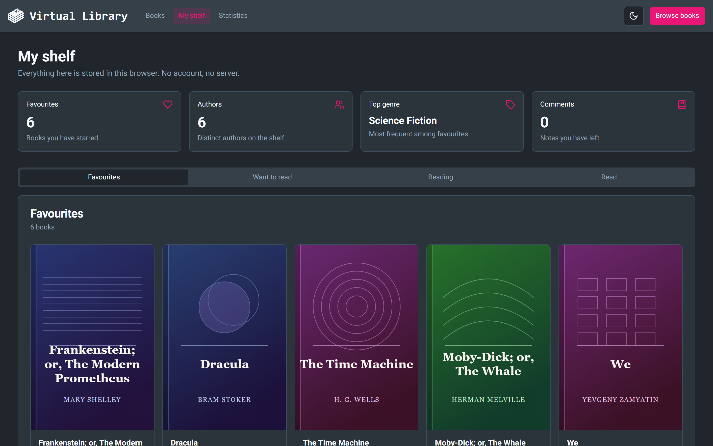
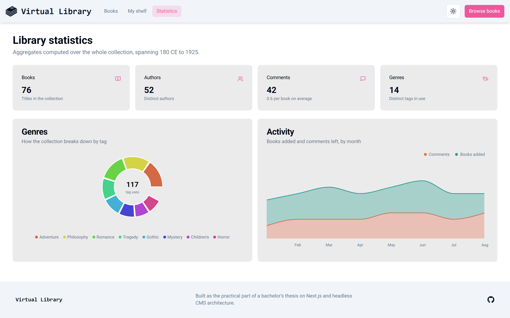
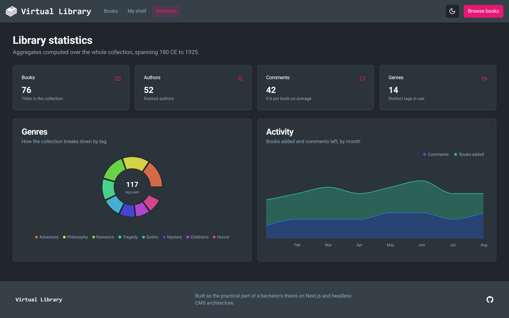

# Virtual Library

[](https://github.com/filipjaruska/virtual-library/actions/workflows/ci.yml)
[](LICENSE)

A book collection you can browse, search, filter and shelve.

**Live demo → [virtual-library-rho.vercel.app](https://virtual-library-rho.vercel.app/)**



This started as the practical component of a bachelor's thesis, _"Leveraging a Content Management System (CMS) in conjunction with Next.js"_ ([full text](https://theses.cz/id/m5huc8/)). The brief was to show how a headless CMS could back a modern React frontend: what the integration looks like, how the two communicate, and what the architecture costs you.

The thesis backend, Strapi on Railway with Postgres, has since been decommissioned, which is the ordinary fate of a student project's hosting bill. Rather than let the demo rot, the frontend now ships its own dataset and runs standalone, while keeping the CMS integration intact as a configurable content source. The Strapi application is still in [`backend/`](backend/), schemas and all.

## Features

|                     |                                                                                                                                                                 |
| ------------------- | --------------------------------------------------------------------------------------------------------------------------------------------------------------- |
| **Catalogue**       | 76 titles with descriptions, genres, publication years and links out to Project Gutenberg. Paginated grid, detail page per book.                                |
| **Search & filter** | Full-text across title, author and description; filter by genre; seven sort orders. All state lives in the URL, so any view is linkable and survives a refresh. |
| **Shelf**           | Favourite books and track them as _want to read_ / _reading_ / _read_. Kept in `localStorage` via Zustand — no account, nothing leaves the browser.             |
| **Comments**        | Leave notes on any book. Yours sit alongside the ones bundled with the collection and can be deleted again.                                                     |
| **Statistics**      | Genre distribution and month-by-month activity, rendered with Recharts.                                                                                         |
| **Command palette** | `Ctrl+K` for navigation and theme switching, via kbar. `Ctrl+F` jumps to search.                                                                                |
| **Three themes**    | Light, dark and an OLED-black variant, resolved before first paint so there is no flash.                                                                        |

## Screenshots

|                 | Light                                       | Dark                                       |
| --------------- | ------------------------------------------- | ------------------------------------------ |
| **Home**        |         |         |
| **Books**       |        |        |
| **Book detail** |  |  |
| **Shelf**       |        |        |
| **Statistics**  |        |        |

Regenerate with `npm run screenshots` (see [below](#regenerating-the-screenshots)).

## Architecture

```
virtual-library/
├── frontend/     Next.js 15 (App Router) + React 19
└── backend/      Strapi v4 — the original thesis CMS
```

### Two content sources, one interface

Everything the app renders goes through `src/lib/content`, which exposes plain functions (`getBooks`, `getBook`, `getLibraryStats`, …) and hides where the data came from.

```
lib/content/
├── index.ts    public API — what pages import
├── source.ts   which source answers, and the circuit breaker
├── strapi.ts   Strapi v4 adapter
├── local.ts    bundled adapter (query, filter, sort, paginate)
└── seed/       the collection, its comments, and the page content
```

Strapi is the **primary** source whenever `NEXT_PUBLIC_STRAPI_URL` is set. The bundled collection is the fallback. The deployed site sets no URL at all, so it resolves locally and never opens a socket.

The interesting part is what happens when a URL _is_ configured and the CMS is down. Wrapping each loader in its own `try`/`catch` would mean paying a failed round-trip on every loader on every render — a dead backend would make each page crawl. Instead `source.ts` keeps a circuit breaker: the first failure trips it for a 60-second window, during which every call resolves straight to the bundled data. Requests also carry an `AbortSignal.timeout`, so an unresponsive host cannot stall a render. One timeout per window, not one per query.

```ts
export async function fromStrapi<T>(
  viaStrapi: () => Promise<T>,
  viaLocal: () => T,
): Promise<T> {
  if (!strapiUrl() || breakerOpen()) return viaLocal();
  try {
    return await viaStrapi();
  } catch (error) {
    trip(error);
    return viaLocal();
  }
}
```

Fallback is per-resource, so a Strapi that is up but missing one content type still renders the rest.

### Client state

Favourites, reading status and comments are anonymous and browser-local, held in a Zustand store persisted to `localStorage`.

Persisted state is invisible to the server, so the store uses `skipHydration` and is rehydrated after mount by a `useHydrated` hook. Components read it only once that flips, rendering a neutral state until then. Without this, the first client render disagrees with the server HTML and React throws a hydration error — the usual way this feature goes wrong.

### Generated covers

The original cover images were CMS media uploads and went with the instance. Covers are now drawn from each book's slug: a hash picks a hue and one of six geometric motifs, and the title and author are set into an SVG. Stable, unique per book, and no external image host — the app requests no third-party assets at all.

### Data flow

Book pages are prerendered at build time from `generateStaticParams`, with `dynamicParams = false` so an unknown slug returns a genuine 404 rather than a soft one. The books listing is server-rendered per request because its state is entirely URL-driven; the client component handles only the debounced input and `useTransition` pending states.

## Running it

### Frontend

```bash
cd frontend
npm install
npm run dev
```

That is the whole setup — no environment file, no backend. `http://localhost:3000`.

| Command               |                                   |
| --------------------- | --------------------------------- |
| `npm run dev`         | Dev server (Turbopack)            |
| `npm run build`       | Production build                  |
| `npm run start`       | Serve the production build        |
| `npm run lint`        | ESLint                            |
| `npm run typecheck`   | `tsc --noEmit`                    |
| `npm run screenshots` | Regenerate the README screenshots |

### Frontend against Strapi

To exercise the CMS path, start the backend and point the frontend at it:

```bash
cd backend
npm install
cp .env.example .env       # then fill in the secrets it lists
npm run develop            # admin panel at http://localhost:1337/admin
```

Generate the required secrets (`APP_KEYS`, `API_TOKEN_SALT`, `ADMIN_JWT_SECRET`, `TRANSFER_TOKEN_SALT`, `JWT_SECRET`) with `openssl rand -base64 32`. The database defaults to SQLite locally; production used Postgres via `DATABASE_URL`.

Then in `frontend/.env.local`:

```
NEXT_PUBLIC_STRAPI_URL="http://localhost:1337"
```

Content types live in `backend/src/api/`: **Book** (title, author, description, slug, cover, tags, links, comments), **Comment**, and the **Home Page** and **Global** single types that drive the landing page's dynamic zone and the header/footer.

Note that a fresh Strapi is empty — the app will read from it and find nothing. The bundled collection is not imported into the CMS.

### Regenerating the screenshots

```bash
cd frontend
npm run build
npx playwright install chromium   # once
npm run screenshots
```

`scripts/screenshots.mjs` starts the production server on its own port, seeds a shelf so that page is not an empty state, and captures each page in light and dark to `docs/screenshots/`.

## Stack

|                                                                                  |                                                     |
| -------------------------------------------------------------------------------- | --------------------------------------------------- |
| [Next.js 15](https://nextjs.org/)                                                | App Router, server components, static generation    |
| [React 19](https://react.dev/)                                                   |                                                     |
| [Zustand](https://zustand.docs.pmnd.rs/)                                         | Persisted client state for the shelf and comments   |
| [Tailwind CSS](https://tailwindcss.com/) + [Radix UI](https://www.radix-ui.com/) | Styling and unstyled primitives                     |
| [Recharts](https://recharts.org/)                                                | Statistics charts                                   |
| [React Hook Form](https://react-hook-form.com/) + [Zod](https://zod.dev/)        | Comment form and env validation                     |
| [kbar](https://kbar.vercel.app/)                                                 | Command palette                                     |
| [Strapi v4](https://strapi.io/)                                                  | The thesis CMS, still supported as a content source |

## License

MIT — see [LICENSE](LICENSE).
